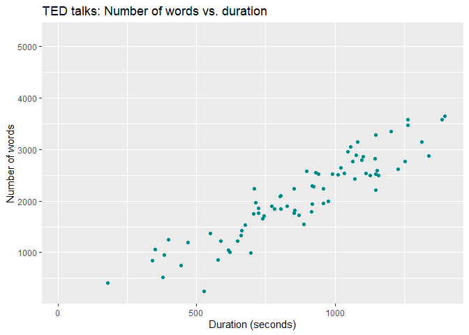
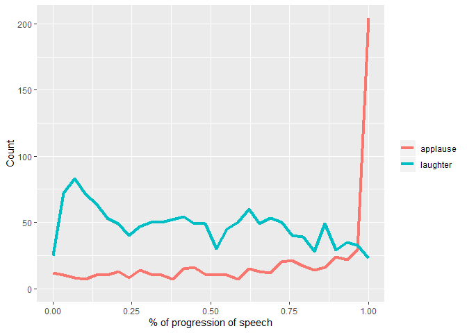
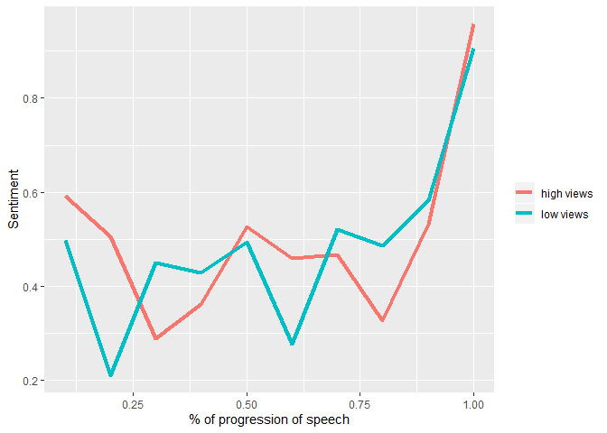

Text\_project
================

``` r
library(tidyverse) # combine and reshape data
```

    ## -- Attaching packages ----------------------------------------------------------------------------------------------- tidyverse 1.2.1 --

    ## v ggplot2 3.2.0     v purrr   0.3.2
    ## v tibble  2.1.3     v dplyr   0.8.3
    ## v tidyr   0.8.3     v stringr 1.4.0
    ## v readr   1.3.1     v forcats 0.4.0

    ## -- Conflicts -------------------------------------------------------------------------------------------------- tidyverse_conflicts() --
    ## x dplyr::filter() masks stats::filter()
    ## x dplyr::lag()    masks stats::lag()

``` r
library(tidytext) # tokenize
library(stringr) # working with strings
library(lubridate) # working with dates
```

    ## 
    ## Attaching package: 'lubridate'

    ## The following object is masked from 'package:base':
    ## 
    ##     date

``` r
library(ggExtra) # ggplot extras
library(lubridate)
library(dplyr)
library(ggplot2)
library(textdata)
```

``` r
ted <- read.csv('cleaned2.csv',stringsAsFactors=FALSE)

mtos = function(minutes){
  seconds = period_to_seconds(ms(minutes))
  return(seconds)
}

ted["duration"] = lapply(ted["duration"] ,mtos)
```

    ## Warning in .parse_hms(..., order = "MS", quiet = quiet): Some strings
    ## failed to parse, or all strings are NAs

``` r
ted = ted[order(ted$views),]
ted_low = ted[0:93,]
ted_high = ted[94:186,]

ted_words <- ted %>%
  unnest_tokens(word,transcript) %>%
  select(Title,word) # select these two variables only

ted_high_words <- ted_high %>%
  unnest_tokens(word,transcript) %>%
  select(Title,word) # select these two variables only

ted_low_words <- ted_low %>%
  unnest_tokens(word,transcript) %>%
  select(Title,word) # select these two variables only
```

``` r
ted_words %>% group_by(Title) %>% 
  summarise(nwords = n()) %>% 
  full_join(ted_high, by = "Title") %>%
  ggplot(., aes(duration, nwords)) + geom_point(col = "darkcyan") + 
    labs(title="TED talks: Number of words vs. duration", 
         x="Duration (seconds)", y="Number of words")
```

    ## Warning: Removed 103 rows containing missing values (geom_point).

<!-- -->

``` r
ted_words %>%
  group_by(Title) %>%
  mutate(word_pos = row_number() / n()) %>%
  filter(str_to_lower(word) == "applause" | str_to_lower(word) == "laughter") %>%
  ggplot(., aes(word_pos, col = word)) +
    geom_freqpoly(size = 1.5) + xlim(0, 1) +
    labs(x="% of progression of speech", y="Count") +
  theme(legend.title=element_blank())
```

    ## `stat_bin()` using `bins = 30`. Pick better value with `binwidth`.

    ## Warning: Removed 4 rows containing missing values (geom_path).

<!-- -->

``` r
h = ted_high_words %>%
  group_by(Title) %>%
  mutate(word_pos = row_number() / n(),
         decile = ceiling(word_pos * 10) / 10) %>%
  group_by(decile, word) %>% 
  summarise(n = n()) %>%
  inner_join(get_sentiments("afinn"), by = "word") %>%
  group_by(decile) %>%
  summarize(value = sum(value * n) / sum(n))
l = ted_low_words %>%
  group_by(Title) %>%
  mutate(word_pos = row_number() / n(),
         decile = ceiling(word_pos * 10) / 10) %>%
  group_by(decile, word) %>% 
  summarise(n = n()) %>%
  inner_join(get_sentiments("afinn"), by = "word") %>%
  group_by(decile) %>%
  summarize(value = sum(value * n) / sum(n))
comb = merge(h,l, by.x = "decile", by.y = "decile")
names(comb)[2] = "high_views"
names(comb)[3] = "low_views"


comb %>% 
  ggplot() +
  geom_line(aes(x=decile, y=high_views, color="a"), size=1.5) +
  geom_line(aes(x=decile, y=low_views, color="b"), size=1.5) +
  scale_color_discrete(name = "Amount of views", labels = c("a"="high views", "b"="low views")) +
  labs(x="% of progression of speech", y="Sentiment") +
  theme(legend.title=element_blank())
```

<!-- -->
